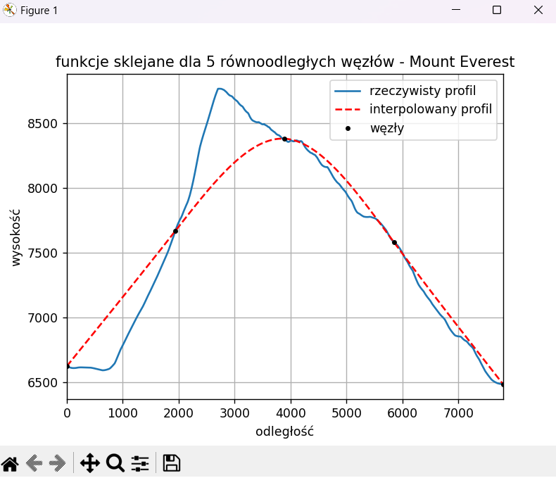

# Height profile interpolation

A student project written in Python implementing Lagrange interpolation and spline interpolation of height profiles on different sets of data.

## Description
Interpolation is a numerical method which is a process of estimating values between known data.  

The goal of the project is to compare two popular methods which are:
- Lagrange interpolation - constructing an interpolation function based on calculated polynomials
- spline interpolation  - based on local interpolation

#### Parameteres

For each method the process of evaluating the height profile is carried out with two parameteres changing to observe the differences in their behaviours:
- number of known points - amount of data that is used for the calculations  
- arrangement - data can be spread out evenly or randomly

#### Data sets
Interpolation is done on three types of data sets:
- `MountEverest.csv` - height of Mount Everest over a certain distance
- `SpacerniakGdansk.csv` - differences in height over the length of a promenade in Gdansk
- `WielkiKanionKolorado.csv` - terrain changes in the Colorado Canyon

## Setup
How to run this project:
1. Clone this repository:
```bash
git clone https://github.com/kalinovsk1/height-profile-interpolation.git
cd height-profile-interpolation
```
3. Install needed libraries:
```
pip install -r requirements.txt
```
3. Run the project:
```
python interpolation.py
```

## Results

To present the results of the interpolation, different plots are created using the matplotlib library and are being saved in the `results` catalogue.

#### Example result 


